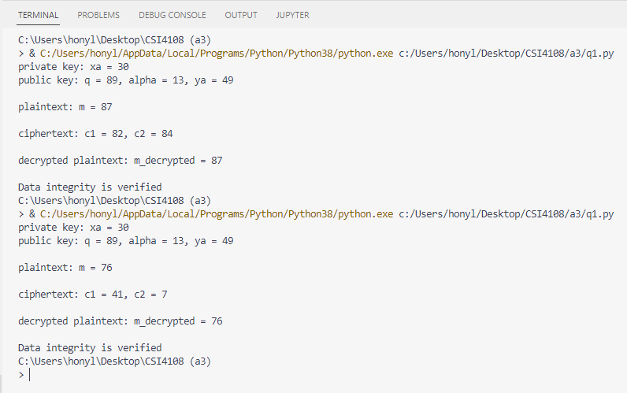
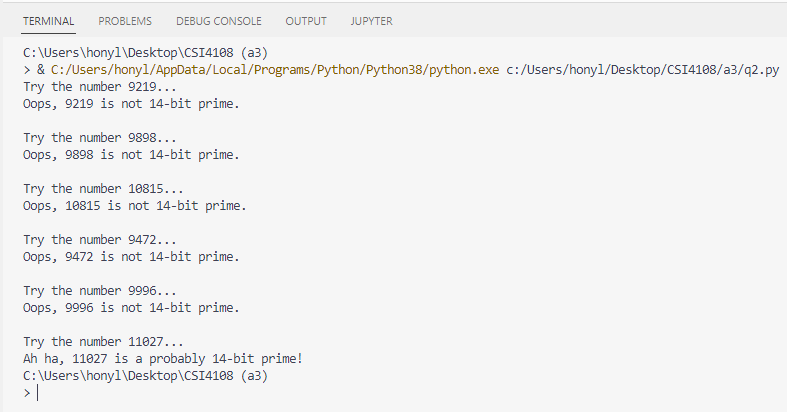
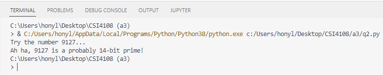
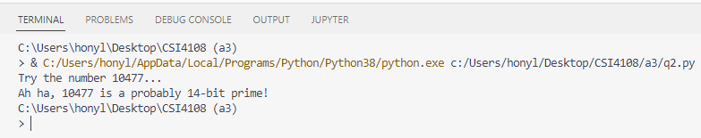
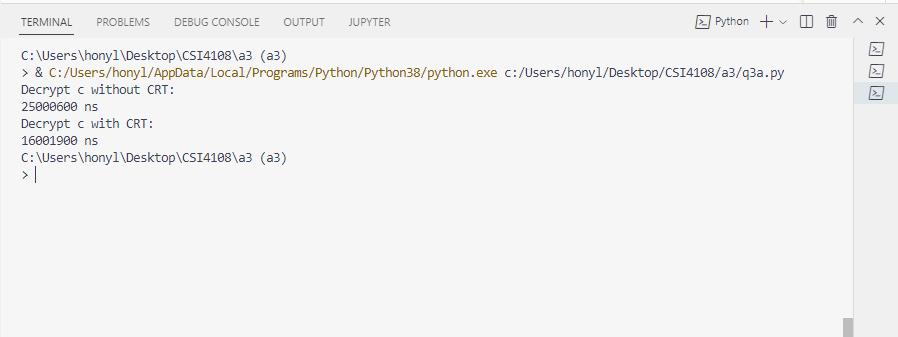

# CSI4108 Assignment 3

Hongyi Lin, 300053082

***

- [CSI4108 Assignment 3](#csi4108-assignment-3)
  - [Question 1](#question-1)
  - [Question 2](#question-2)
  - [Question 3](#question-3)
    - [Part a](#part-a)
    - [Part b](#part-b)

***

## Question 1
source code: `q1.py`

The running results of my code:

During the encryption process, we get get the ciphertext from $m_1$ and $m_2$ as:
* For $m_1$, $C_{1, 1} = \alpha^k \mod q$, $C_{2, 1} = Km_1 \mod q$
* For $m_2$, $C_{1, 2} = \alpha^k \mod q$, $C_{2, 2} = Km_2 \mod q$

As for $K = (Y_A)^k \mod q$ when $k$ is the same, $K$ must be the same.
Hence, we have

$$ \frac{C_{2, 2}}{C_{2, 1}} = \frac{Km_2 \mod q}{Km_1 \mod q} = \frac{m_2 \mod q}{m_1 \mod q} $$

From this, we can calculate $m2$ as $m_2 = (C_{2, 1})^{-1}C_{2,2}m_1 \mod q$.

From the question, we know that $q = 89, \alpha = 13$ and for $m_1 = 56$ and $m_2$, the $k = 37$ is the same. Suppose that $X_A = 15$, then $Y_A = 7$ and $C_{2, 1} = 31$ can be calculated. With $C_{2, 1} = 31$, $(C_{2, 1})^{-1} \mod q = (C_{2, 1})^{-1} \mod 89 = 23$. Now, if we can know that $C_{2, 2} = 11$, then the plaintext $m_2 = (C_{2, 1})^{-1}C_{2,2}m_1 \mod q = 23 \times 11 \times 56 \mod 89 = 17$ can be calculated.

## Question 2
source code: `q2.py`

After checking the table in the given link, 11027, 9127 and 10477 are all prime numbers.

## Question 3

### Part a
source code: `q3a.py`

### Part b

