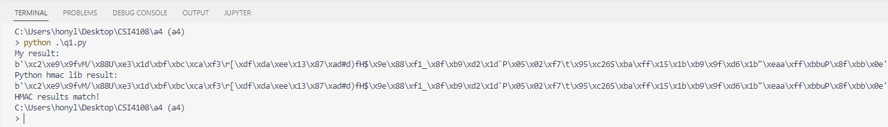
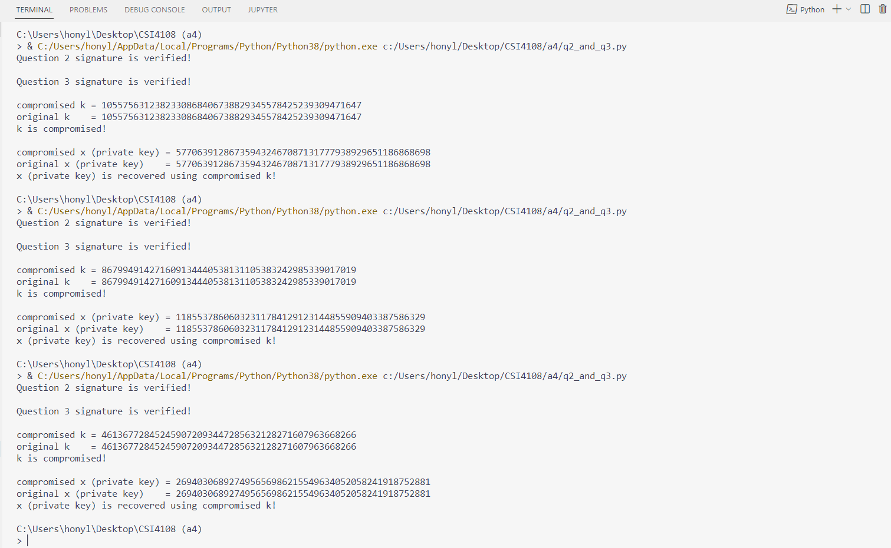

# CSI4108 Assignment 3

Hongyi Lin, 300053082

***

- [CSI4108 Assignment 3](#csi4108-assignment-3)
  - [General](#general)
  - [Question 1](#question-1)
  - [Question 2 and Question 3](#question-2-and-question-3)

***

## General
`math_helper.py` contains the helper functions to do the required math operations.

## Question 1
source code: `q1.py`

## Question 2 and Question 3
source code:
* `dsa_num_gen.py`: Generate the system parameters of DSA, 1024-bit prime `p`, 160-bit prime `q`, and the generator `g`.
* `dsa_num.py`: Generated files by `dsa_num_gen.py` containing the DSA system parameters.
* `dsa.py`: Contain the `Dsa` class to implement the DSA algorithm with the sign and verify operations. This class use `hashlib.sha1` as the default hash function as required by the question 2.
* `q2_and_q3.py`: the script to run the simulation described in the PDF.

As we can see the results in the screenshot above, the `k` is compromised each time from the two signatures using the same `k`. From the compromised `k`, the private key `x` can also be recovered each time.
